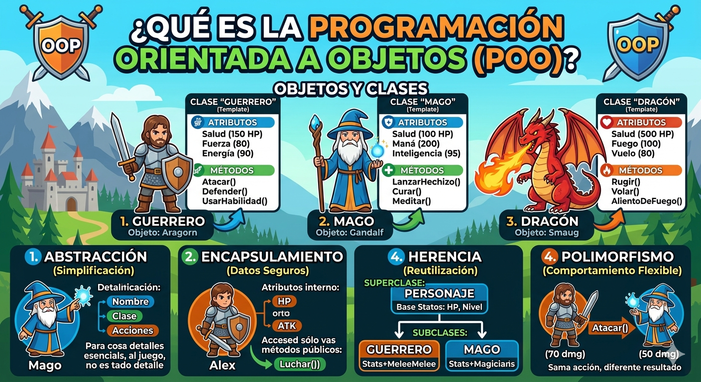
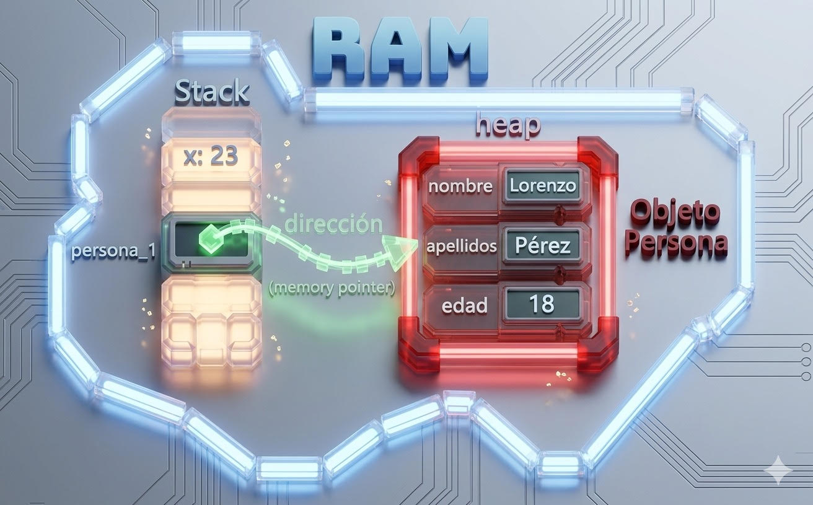

# POO en Python
Introduccion a la Programacion Orientada a Objetos (POO)

## ¿Porque aprender POO?

- Imagina que quieres crear un video juego, tienes guerreros, magos, dragones... con sus propios puntos de vida, ataques y habilidades y aca aparece una pregunta como los organizo sin repetir todo una y otra vez?

- la **POO** es la respuesta. en lugar de escribir instrucciones sueltas modelas el mundo real con *objetos* que tienen caracteristicas y comportamientos. es la forma en que estan construidos la mayoria de los programas profecionales del mundo.



## Clase y objeto

- Una clase es un tipo de dato cuyas variables se llaman objetos o instancia.

- la clase es la definicion de objeto del mundo real y los objetos o instancias son el propio "objeto" del mundo real.

- las clases estan compuestas por dos elementos:
    - **atributos:** informacion que almacena la clase.
    - **metodos:** operaciones que puedan realizarse con la clase.

## Definicion de una clase en python

``` py
class nombre de la clase:

    def __init__(self, variable1, variable2):
        self.atributo1 = valor1
        self.atributo2 = valor2

    def nombreMetodo(self):
        BloqueCodigo
```

-  `class` : palabra resevada en python para definir una clase

- `NombreClase` : nombre de la clase que se quiere crear

- `def` : palabra reservada en python que se utiliza para definir tanto el contructor de la clase(metodo que se ejecuta la primera vez que se usa una clase) como los diferentes metodos que tiene.

- `__init__`  : palabra reservada en python para definir el metodo constructor de la clase. el metodo `__init__`  : es lo primero que se ejecuta cuando creas un objeto de una clase.

- `self , variableX`  : parametro del contructor de la clase. el parametro `self`es obligatorio y despues puedes tener tantos parametros como quieras

`self , atributoX` : forma de utilizacion y acceso alos atrubutos de la clase

- `NombreMetodo`  : nombre del metodo de la clase

- `self` : parametro del metodo. el parametro self es obligatorio y despues puedes tener tantos parametros como quieras. la forma de añadir parametros es la misma que las funciones

- `bloquecodigo`  : instrucciones que ejecutara el metodo

**al definir una clase tenga en cuenta:**
- puedes definir tantos atributos como nesesites
- puedes definir tantos metodos como nesesites
- puedes definir tantos parametros en el contructor y en los metodos como nesesites

## Ejemplo 1
- crear una clase que represente una persona
- Atrubutos: nombre apellido y edad.
- metodos: mostrar la informacion de la persona

### Codigo

``` py
class persona:
    def __init__(self, nombre, apellidos, edad):
        self.nombre = nombre
        self.apellidos = apellidos
        self.edad = edad

# Metodo para mostrar el nombre de la persona
    def mostrarpersona(self):
        print("nombre: ", self.nombre)
        print("apellidos: ", self.apellidos)
        print("edad: ", self.edad)

def main ():
    print("vamos a aprender poo...")
    persona_1 = persona(lorenzo, perez, 18)
    persona_1.mostrarpersona()

if __name__ == main():
    main()
```
## representacion grafica en ram del objeto creado

